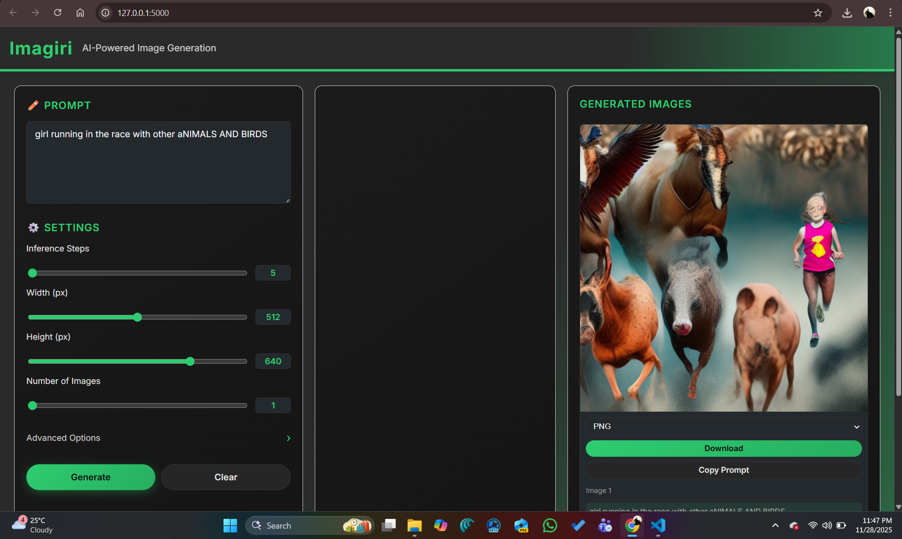
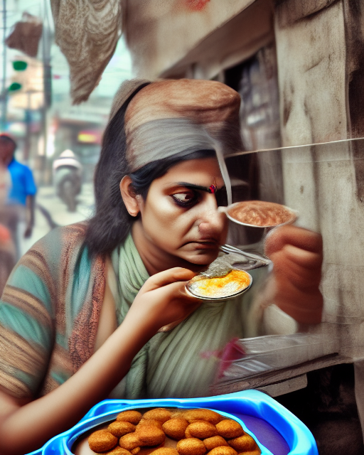

# Imagiri – AI Text-to-Image Generator

[Live Demo](https://imagiri-ai.onrender.com)
the deployment isn't working due to ```Web Service imagiri.ai exceeded its memory limit```

Imagiri is a web-based text-to-image generation system built with open-source models and frameworks. It lets users enter natural language prompts and generate high-quality images with configurable parameters like steps, resolution, and number of images.

---

## Preview

Main UI preview:



Sample generated images:




(Place `sample.png` in the repo root, and put `sample1.png` and `sample2.png` inside `generated_images/` or adjust the paths above.)

---

## Features

- Text-to-image generation from natural language prompts
- Adjustable:
  - Inference steps
  - Width and height
  - Number of images per prompt
- Prompt enhancement toggle (adds quality descriptors automatically)
- Optional negative prompts to filter unwanted outputs
- Loading screen with model initialization status
- Web UI with:
  - Prompt input
  - Advanced settings
  - Progress indicator
  - Image gallery with PNG/JPEG download
  - Activity log with basic generation events
- CSV logging of generations (prompts, parameters, filenames, timestamps)

---

## Architecture Overview

Imagiri has a simple client–server architecture:

- Backend:
  - Flask app (`app.py`)
  - Loads a Stable Diffusion-based text-to-image pipeline once at startup
  - Exposes REST endpoints:
    - `/api/status` – reports model load status
    - `/api/generate` – runs image generation with given parameters
    - `/download/<basename>/<fmt>` – serves generated images as PNG/JPEG
  - Logs generations to `generated_images/generation_log.csv`

- Frontend:
  - Single-page UI (`templates/index.html`)
  - Loading overlay while model is initializing
  - Prompt and settings panel
  - Progress / status panel
  - Generated images panel with downloads
  - Activity log at the bottom

---

## Technology Stack

- Language: Python
- Web framework: Flask
- Model library: diffusers (Hugging Face)
- Model: Dreamlike Diffusion 1.0 (Stable Diffusion-based)
- Deep learning backend: PyTorch
- Frontend: HTML, CSS, vanilla JavaScript
- Deployment: Render (Python Web Service)

Model reference:

- Dreamlike Diffusion 1.0:  
  https://huggingface.co/dreamlike-art/dreamlike-diffusion-1.0
- Other text-to-image models:  
  https://huggingface.co/models?pipeline_tag=text-to-image&sort=trending

---
END !!
---
